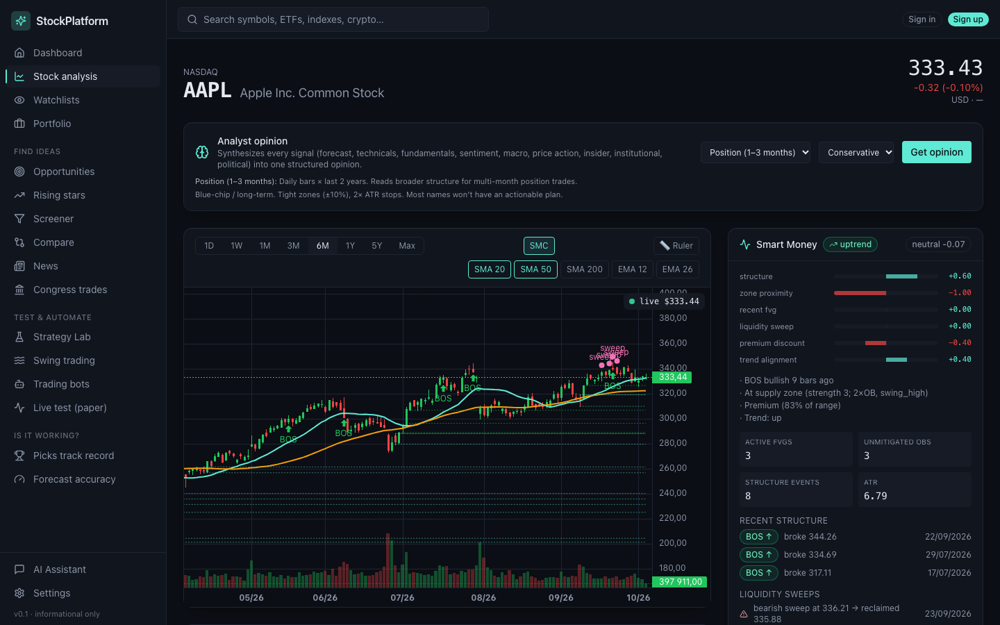
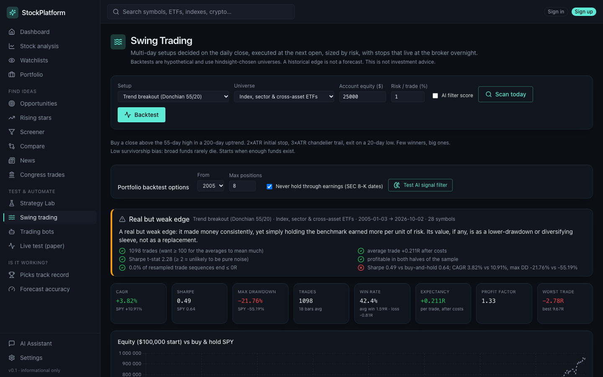
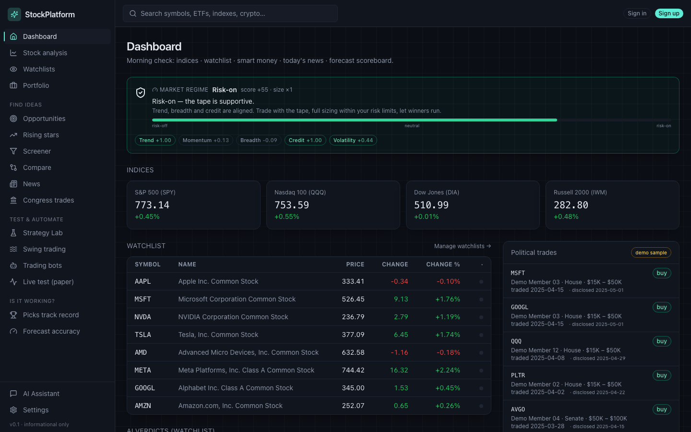
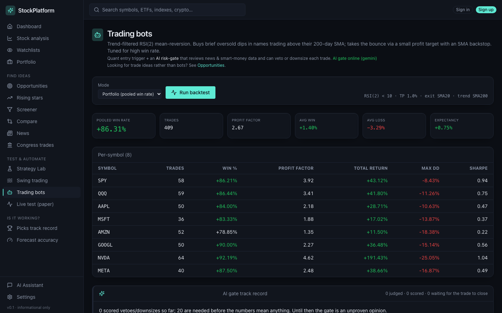
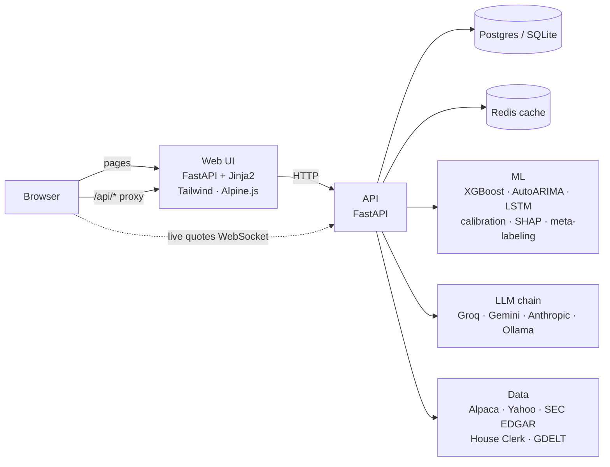

# StockPlatform

**An end-to-end ML and GenAI platform for equity research, built around one rule: measure honestly.**

[](https://github.com/anaguedes0802/StockPlatform/actions/workflows/ci.yml)


StockPlatform forecasts returns with calibrated uncertainty, ranks stocks, backtests trading strategies at portfolio level and puts an LLM assistant on top of the platform's own data. It ships as a FastAPI backend and a server-rendered web UI.

The interesting part is the research. Every idea, from XGBoost forecasts to copying Congress trades, was tested with walk-forward validation, cost modelling, placebo controls and decision rules written down **before** the results were seen. Most of the ideas failed, and the repo documents why. That is the point: in finance, a model that cannot tell an edge from survivorship bias or calendar luck is worse than no model.

> Informational and educational only. Not investment advice. No real money is traded: execution is paper or simulated.

| Stock analysis: chart, smart-money read, forecast | Swing backtest with an explicit verdict |
|---|---|
|  |  |
| **Dashboard: market regime, indices, watchlist** | **Trading bots and the AI risk-gate track record** |
|  |  |

---

## Highlights

**Data science and ML**
- **Probabilistic forecasting.** A quantile XGBoost and an AutoARIMA ensemble predict p10…p90 bands at 1/5/30 days. Out-of-sample calibration brings an 80% band to 76–88% coverage, scored with pinball loss against a climatology baseline ([`ml/calibration.py`](apps/api/app/ml/calibration.py), [`ml/xgboost_model.py`](apps/api/app/ml/xgboost_model.py)).
- **Explainability.** SHAP attributions are grouped into technical, fundamental, sentiment, macro and event buckets. They are shown only when the model has earned weight out of sample.
- **Meta-labeling.** A secondary GBM decides whether to take a trading signal. It is evaluated with yearly walk-forward plus a 10-day embargo, a paired block bootstrap of ΔSharpe, and random and perfect-foresight reference filters ([`ml/signal_filter.py`](apps/api/app/ml/signal_filter.py)).
- **Event studies with placebos.** Insider cluster buys are compared with the same stocks on random dates and with momentum-matched stocks, using a calendar-month cluster bootstrap ([`ml/insider_study.py`](apps/api/app/ml/insider_study.py)).
- **Regime detection.** Rule-based (trend × volatility, with hysteresis) vs a Markov-switching HMM, chosen by a pre-declared rule ([`swing_agent/regime_*.py`](apps/api/app/swing_agent)).
- **Bias control.**
  - A point-in-time S&P 500 universe that includes delisted names.
  - Survivorship bias measured three ways.
  - Point-in-time fundamentals keyed to SEC filing dates.
  - Mutation tests that poison the future and assert nothing before it changes.

**GenAI**
- **Tool-calling assistant.** An LLM answers questions by calling the platform's own APIs (quote, forecast, recommendation, news, backtest…) and streams the answer over Server-Sent Events ([`routers/chat.py`](apps/api/app/routers/chat.py)).
- **LLM risk gate, evaluated prospectively.** The LLM may only approve, downsize or veto a quant signal. Every verdict is logged and later scored against what the trade actually did, because an LLM's market judgement cannot be backtested: it has read about the outcomes ([`services/bot_intel.py`](apps/api/app/services/bot_intel.py), [`services/gate_log.py`](apps/api/app/services/gate_log.py)).
- **Provider-agnostic LLM layer.** Ollama → Groq → Gemini → Anthropic with per-provider cool-offs, JSON-mode parsing and a deterministic fallback for every caller, so the app runs on free tiers ([`services/llm.py`](apps/api/app/services/llm.py)).
- **NLP on news.** finBERT sentiment, zero-shot topic classification (BART-MNLI) and LLM catalyst classification with cross-entity routing.

**Engineering**
- **Backend:** FastAPI modular monolith with SQLAlchemy 2 + Alembic, Redis caching and token-bucket rate limiting, JWT with refresh-token rotation and TOTP 2FA.
- **Engines:** a portfolio-level backtester (shared capital, gap-aware stops, costs, earnings blackout, Monte Carlo, split halves, verdict checks) and a simulated broker for A/B paper tests.
- **Web UI in Python:** FastAPI + Jinja2 templates with Tailwind, Alpine.js and TradingView Lightweight Charts. No Node toolchain.
- **Tests and CI:** 271 API tests and the web UI tests run in GitHub Actions.

---

## Key findings

All numbers are out of sample and after costs. Full write-ups: [`BACKTEST_RESULTS.md`](BACKTEST_RESULTS.md) and [`SWING_AGENT.md`](SWING_AGENT.md).

| Question | Method | Result | Verdict |
|---|---|---|---|
| Can the forecaster beat climatology? | Dense walk-forward (~950 OOS predictions), pinball / Brier skill | Pinball skill went from −9…−56% to slightly positive (AAPL 5d −8.7% → +0.7%; SPY 21d −56.3% → +3.7%). 80% bands now cover 76–88%. The XGBoost overlay earns 0 weight. | Calibration win, not an alpha win |
| Does cross-sectional stock selection beat equal weight? | Same code on a point-in-time S&P 500 (742 names incl. delisted) | Excess vs equal weight +0.5%/yr (t 0.2) in 2017–21. The earlier 23.2% vs 15.2% result was mostly survivorship bias. | Rejected |
| How big is survivorship bias? | One rule, three universes, 2017–2023 | Point-in-time top 40: 14.17% CAGR. "Today's 40 most liquid": 27.16% (+13 pp/yr of fake performance). | Quantified |
| Do textbook swing setups beat SPY? | Portfolio engine 2005–2026, 20 jittered runs, split halves, trade bootstrap | Best (ETF breakout): CAGR 3.98%, Sharpe 0.51 vs SPY 10.89% / 0.64. Best t ≈ 2.3 < 2.7 Bonferroni bar. FX loses even at zero cost. | Rejected |
| Can an ML filter (meta-labeling) improve a setup? | Pre-declared primary test, block-bootstrap ΔSharpe | Primary: AUC 0.516 [0.491, 0.541], ΔSharpe −0.05 [−0.24, 0.15]. One positive case (RSI(2), 0.51 → 0.78) is p ≈ 0.10 after Bonferroni, so it went to a forward A/B test. | Rejected, A/B running |
| Do insider cluster buys carry information? | Event study vs same-stock and momentum-matched placebos | +0.63% [−0.92, +2.18] vs placebo; −1.70% [−3.10, −0.27] vs momentum-matched. It is a buy-after-drop effect. | Rejected |
| Does copying Congress (Pelosi & co.) work? | Copy at the filing date, compare with a naive control | Pelosi: +4.4% vs SPY over 12 months, but a portfolio of the 5 most-traded mega-caps did better (32.0% vs 29.2% CAGR). | Rejected |
| HMM or rules for market regimes? | Pre-declared: must win on all 3 criteria | HMM detects crashes faster (2 vs 11 sessions) but switches 2.6× as often with no better risk separation. | Rules kept |
| Do intraday "smart money" setups pay? | 15m engine, realistic costs, train vs validation | Liquidity sweep: −0.098R per trade (t −8.0). A few bps of spread are ~0.1R on tight stops. | Rejected |
| Does the LLM risk gate save money? | Prospective logging + scoring in R with bootstrap CI | Collecting data; no verdict before 20 scored vetoes/downsizes. | Running |

---

## Architecture



The API is a modular monolith: 18 routers over plain-Python services, designed to split into services later ([`ARCHITECTURE.md`](ARCHITECTURE.md) is the original target design). The web UI serves one template per page and proxies `/api/*` to the backend, so the browser never needs CORS.

```
StockPlatform/
├── apps/
│   ├── api/                 FastAPI backend
│   │   ├── app/ml/          forecasting, calibration, meta-labeling, regimes, event studies
│   │   ├── app/services/    data adapters, LLM layer, recommendation, brokers, news/NLP
│   │   ├── app/backtest/    single-asset and portfolio-level backtest engines
│   │   ├── app/swing_agent/ multi-timeframe research pipeline (point-in-time data, regimes, 15m engine)
│   │   ├── app/routers/     REST + SSE + WebSocket endpoints
│   │   └── tests/           271 tests (no network)
│   └── web/                 Python web UI (FastAPI + Jinja2 templates, Tailwind, Alpine.js)
├── scripts/                 reproducible research runs (walk-forward, studies, backtests)
├── BACKTEST_RESULTS.md      every experiment, method and number
├── SWING_AGENT.md           phased swing-agent research log
└── ARCHITECTURE.md          original system design
```

---

## Quick start

**Docker** (Postgres + Redis + API + web):

```bash
cp .env.example .env    # optional: add a free GROQ_API_KEY for the AI assistant
docker compose up -d
```

Web UI at http://localhost:3000. API docs (Swagger) at http://localhost:8000/docs.

**Without Docker** (SQLite, no Redis):

```bash
# API
cd apps/api
python -m venv .venv && source .venv/bin/activate
pip install -e ".[dev]"            # add ".[dev,ml-deep]" for the LSTM and finBERT
DATABASE_URL=sqlite:///./dev.db REDIS_URL=redis://disabled uvicorn app.main:app --port 8000

# Web UI (second terminal)
cd apps/web
python -m venv .venv && source .venv/bin/activate
pip install -e .
uvicorn app.main:app --port 3000
```

On macOS, XGBoost needs OpenMP: `brew install libomp`.

**Tests**

```bash
cd apps/api && pytest      # 271 tests, offline
cd apps/web && pytest      # every page renders + /api proxy
```

The first forecast for a symbol trains the models on the fly (about a minute), then they are cached on disk.

---

## Limitations

- **Free data has gaps:**
  - yfinance has ~5 quarters of financials.
  - Alpaca's free IEX feed under-counts highs and lows.
  - Spin-offs are recorded as reverse splits.
  - There is no free point-in-time S&P 400.
  
  These are documented where they matter.
- **Survivorship-biased universes.** Some studies (S&P 500+400 by today's members) are biased upwards. Only the excess over equal weight is treated as fair, and point-in-time tests overrule them.
- **The forecaster is calibrated but has no directional edge.** Bands are honest; direction is close to "always up" by design.
- **Forward tests are still running.** The RSI(2) ML-filter A/B test and the LLM gate need months of data before a verdict.
- **Design vs implementation.** `ARCHITECTURE.md` describes a target design (MLflow, NATS, Kubernetes) that is not all implemented.

## Tech stack

Python 3.11 · FastAPI · Pydantic v2 · SQLAlchemy 2 · Alembic · PostgreSQL/TimescaleDB · SQLite · Redis · pandas · NumPy · scikit-learn · XGBoost · SHAP · statsforecast (AutoARIMA) · statsmodels (HMM) · Optuna · PyTorch (optional LSTM) · Hugging Face transformers (finBERT, BART-MNLI) · Groq / Gemini / Anthropic / Ollama · Jinja2 · Tailwind CSS · Alpine.js · TradingView Lightweight Charts · Chart.js · Docker Compose · GitHub Actions

## License

MIT, see [LICENSE](LICENSE).
